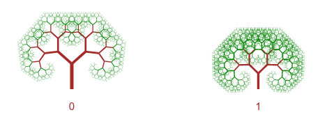

# Tree visualization

This extension displays one or multiple recursively generated trees based on given measures.

## Installation

Save this repository as ZIP and import it via QMC as extension

## Usage

To use this extension, you need to provide following dimensions and measures:

Dimensions:
 
 1. Position - tree position on the X axis (will be normalized to fit the extension size)

Measures:
 
 1. branch length (range 0 to 1)
 2. branch curvature (deflection angle) in degrees
 3. branch segment length reduction factor (range 0 to 1)
 4. trunk size

 
# License
 Author: Tomas Janco, janco@inphinity.xyz

 License: MIT

# Credits
Tree generation algorithm was found on stackoverflow.
Please contact me for attribution.
 